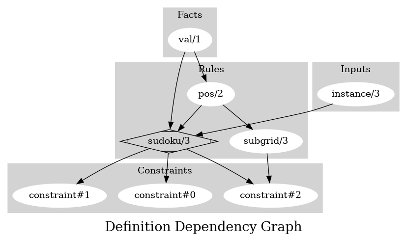
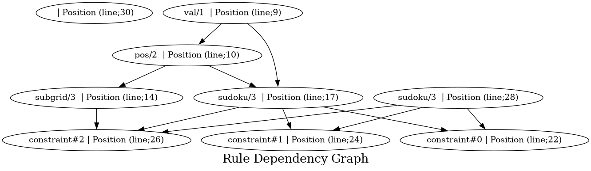

Contributor Documentation
=========================

*Understand the encoding*

Terms
-----

.. list-table:: **Terms definition**
   :widths: 10 30 70
   :header-rows: 1

   * - Term
     - Type
     - Description
    
   * - **X**
     - Integer 0 ≤ X ≤ 9
     - Column index of the cell

   * - **Y**
     - Integer 0 ≤ Y ≤ 9
     - Row index of the cell

   * - **V**
     - Integer 0 ≤ V ≤ 9
     - Value of the cell

Facts
-----

:ref:`val/1`

**val/1**
    Location: `Line;14 <https://github.com/Owrel/clindoc/blob/master/examples/sudoku_without_user_doc.lp#L14>`_

    .. literalinclude:: ../../sudoku.lp
        :language: prolog
        :linenos:
        :lines: 9

Rules
-----

:ref:`pos/2`
**pos/2**
    Dependencies: 
         - :ref:`val/1<val/1>`
    pos(X,Y) 
         - X → Column index of the cell
         - Y → Row index of the cell

    .. literalinclude:: ../../sudoku.lp
        :language: prolog
        :linenos:
        :lines: 10

:ref:`subgrid/3`
**subgrid/3**
    Dependencies: 
         - :ref:`pos/2<pos/2>`
    subgrid(X,Y,S) → The cell (`X`, `Y`) is in subgrid `S`
         - X → Column index of the cell
         - Y → Row index of the cell

    .. literalinclude:: ../../sudoku.lp
        :language: prolog
        :linenos:
        :lines: 14

:ref:`sudoku/3`
**sudoku/3**
     Dependencies:
          - :ref:`pos/2<pos/2>`
          - :ref:`val/1<val/1>` 
     sudoku(X,Y,Y)
          - X → Column index of the cell
          - Y → Row index of the cell
          - V → Value of the cell

     .. literalinclude:: ../../sudoku.lp
        :language: prolog
        :linenos:
        :lines: 17

**sudoku/3**
     Dependencies:
          - instance/3
     sudoku(X,Y,Y)
          - X → Column index of the cell
          - Y → Row index of the cell
          - V → Value of the cell

     .. literalinclude:: ../../sudoku.lp
        :language: prolog
        :linenos:
        :lines: 34

Constraint
----------

**constraint#1**
     Dependencies:
          - :ref:`sudoku/3<sudoku/3>`
     
     Description:
          - Can't repeat values per row

     .. literalinclude:: ../../sudoku.lp
        :language: prolog
        :linenos:
        :lines: 23

**constraint#2**
     Dependencies:
          - :ref:`sudoku/3<sudoku/3>`
     
     Description:
          - Can't repeat values per column
     
     .. literalinclude:: ../../sudoku.lp
        :language: prolog
        :linenos:
        :lines: 26

**constraint#3**
     Dependencies:
          - :ref:`sudoku/3<sudoku/3>`
          - :ref:`subgrid/3<subgrid/3>`

     Description:
          - Can't repeat values per subgrid
     
     .. literalinclude:: ../../sudoku.lp
        :language: prolog
        :linenos:
        :lines: 34

Definition Dependency Graph
---------------------------

Rule Dependency Graph
---------------------------

